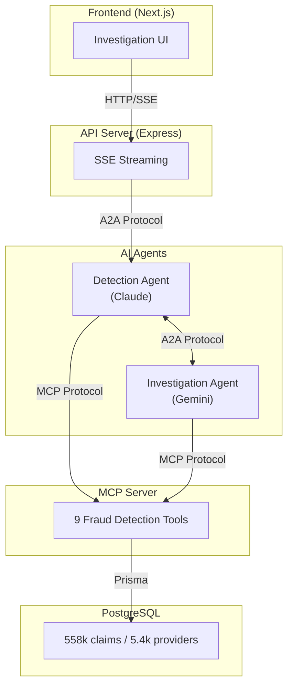

# Solarys Fraud Detection Demo

A demonstration of AI-powered healthcare fraud detection using multi-vendor AI agents that communicate via open protocols. This project showcases how **Claude (Anthropic)** and **Gemini (Google)** work together through the **A2A (Agent-to-Agent)** protocol, while accessing fraud detection tools through **MCP (Model Context Protocol)**.

Engineered by [the Solarys Group](https://solarys.ai) as a proof-of-concept for government healthcare fraud investigation systems.

**[Try the Live Demo →](https://labs.solarys.ai/mcp-a2a)**

---

## Table of Contents

- [Overview](#overview)
- [Architecture](#architecture)
- [Protocol Deep Dive](#protocol-deep-dive)
  - [MCP (Model Context Protocol)](#mcp-model-context-protocol)
  - [A2A (Agent-to-Agent Protocol)](#a2a-agent-to-agent-protocol)
- [Key Components](#key-components)
- [Fraud Detection Tools](#fraud-detection-tools)
- [Data](#data)
- [Project Structure](#project-structure)

---

## Overview

Two AI agents collaborate on fraud investigations:

1. **Detection Agent (Claude)** - Primary orchestrator, runs initial analysis, delegates when needed
2. **Investigation Agent (Gemini)** - Deep-dive specialist for complex cases

Communication happens over open protocols:
- **MCP** - Tool access (queries, anomaly detection, pattern matching)
- **A2A** - Agent-to-agent delegation

---

## Architecture



---

## Protocol Deep Dive

### MCP (Model Context Protocol)

[MCP](https://modelcontextprotocol.io/) is an open protocol by Anthropic that standardizes how AI models interact with external tools. Both agents in this demo access fraud detection tools through the same MCP server.

**Request flow:**

```
AI Agent                    MCP Server                    Database
   │                            │                            │
   │ ──── ListTools ─────────▶  │                            │
   │ ◀─── [9 available tools] ─ │                            │
   │                            │                            │
   │ ──── CallTool ───────────▶ │                            │
   │      "find_anomalies"      │ ──── SQL Query ─────────▶  │
   │      {providerId: "PRV1"}  │ ◀─── Results ───────────── │
   │ ◀─── Tool Result ───────── │                            │
   │      {anomalies: [...]}    │                            │
```

**MCP Implementation (`packages/mcp-server/`):**

- Implements the `@modelcontextprotocol/sdk` server specification
- Supports both stdio (CLI) and HTTP streaming transports
- Routes tool calls to handler functions in `packages/tools/`
- Returns structured JSON responses

### A2A (Agent-to-Agent Protocol)

[A2A](https://github.com/google/A2A) is an open protocol by Google that enables AI agents to communicate and delegate tasks. The Detection Agent (Claude) delegates deep-dive investigations to the Investigation Agent (Gemini) via A2A.

**Delegation flow:**

```
API Server                  Detection Agent              Investigation Agent
    │                          (Claude)                       (Gemini)
    │                             │                              │
    │ ── A2A Message ───────────▶ │                              │
    │    "Investigate PRV51234"   │                              │
    │                             │                              │
    │                             │ (runs initial analysis)      │
    │                             │                              │
    │ ◀── Status: "working" ───── │                              │
    │ ◀── Event: tool_call ────── │                              │
    │                             │                              │
    │                             │ ── A2A Delegation ─────────▶ │
    │                             │    "Deep investigation       │
    │                             │     needed for PRV51234"     │
    │                             │                              │
    │ ◀── Event: delegation ───── │                              │
    │                             │ ◀── Investigation Result ─── │
    │                             │                              │
    │ ◀── Final Report ────────── │                              │
```

**A2A Implementation (`agents/src/`):**

Each agent exposes A2A-compliant endpoints:
- `/.well-known/agent.json` - Agent card (capabilities, skills, authentication)
- `/a2a/jsonrpc` - JSON-RPC message transport
- `/a2a/rest` - REST streaming transport for real-time updates

**Agent Cards:**

Both agents publish "agent cards" describing their capabilities:

```json
{
  "name": "Fraud Detection Agent",
  "description": "Orchestrates healthcare fraud investigations",
  "skills": [
    {
      "name": "investigate",
      "description": "Run fraud investigation on a provider"
    }
  ],
  "supportedProtocols": ["a2a/1.0"]
}
```

---

## Key Components

| Component | Location | Purpose |
|-----------|----------|---------|
| **Frontend** | `apps/web/` | Next.js React app with real-time investigation UI |
| **API Server** | `apps/api/` | Express.js server, routes to agents, streams events |
| **Detection Agent** | `agents/src/fraud-detection/` | Claude-powered primary investigation agent |
| **Investigation Agent** | `agents/src/claims-investigation/` | Gemini-powered deep analysis agent |
| **MCP Server** | `packages/mcp-server/` | Protocol-compliant tool server |
| **Tools** | `packages/tools/` | Fraud detection tool implementations |
| **Database** | `packages/db/` | Prisma schema and client |

---

## Fraud Detection Tools

All tools are accessible via MCP and can be called by any agent:

| Tool | Description | Use Case |
|------|-------------|----------|
| `find_anomalies` | Statistical outlier detection | Identify providers with unusual billing patterns |
| `detect_fraud_rings` | Network analysis | Find clusters of providers sharing beneficiaries suspiciously |
| `check_deceased_claims` | Temporal validation | Detect claims submitted after beneficiary death |
| `investigate_provider` | Comprehensive analysis | Full investigation combining multiple checks |
| `get_provider_stats` | Basic metrics | Provider claim counts, amounts, and patterns |
| `explain_risk_score` | Explainability | Break down why a provider has their risk level |
| `search_similar_providers` | Embedding search | Find providers with similar billing patterns |
| `search_fraud_patterns` | Natural language search | Query fraud patterns in plain English |
| `get_audit_log` | Compliance | Retrieve investigation history for audit |

---

## Data

This demo uses the [Healthcare Provider Fraud Detection Dataset](https://www.kaggle.com/datasets/rohitrox/healthcare-provider-fraud-detection-analysis) from Kaggle, containing:

- **558,000+ healthcare claims** with diagnosis codes, procedure codes, and reimbursement amounts
- **5,410 healthcare providers** with fraud labels
- **138,000+ Medicare beneficiaries** with demographics and chronic condition flags

The data is loaded into PostgreSQL and includes computed fields for risk scoring and anomaly detection.

---

## Project Structure

```
solarys-fraud-detection-demo/
├── agents/                         # AI Agent implementations
│   └── src/
│       ├── fraud-detection/        # Claude agent (primary)
│       │   ├── server.ts           # A2A server setup
│       │   ├── claude.ts           # Anthropic SDK integration
│       │   └── skills.ts           # Agent skill definitions
│       └── claims-investigation/   # Gemini agent (specialist)
│           ├── server.ts           # A2A server setup
│           └── gemini.ts           # Google AI SDK integration
│
├── apps/
│   ├── api/                        # Express.js API server
│   │   └── src/
│   │       ├── routes/chat.ts      # Main chat endpoint (SSE)
│   │       └── lib/a2a-client.ts   # A2A SDK client wrapper
│   └── web/                        # Next.js frontend
│       └── src/
│           ├── app/trs-demo/       # Demo page
│           └── components/
│               └── investigation/  # Investigation UI components
│
├── packages/
│   ├── db/                         # Database layer
│   │   └── prisma/
│   │       ├── schema.prisma       # Data model
│   │       └── seed.ts             # Data loading
│   ├── mcp-server/                 # MCP protocol server
│   │   └── src/
│   │       ├── http.ts             # HTTP transport
│   │       └── stdio.ts            # CLI transport
│   ├── tools/                      # Tool implementations
│   │   └── src/handlers/           # Individual tool handlers
│   └── types/                      # Shared TypeScript types
│
└── data/                           # Healthcare claims CSV files
```

---

## License

MIT

---

## Contact

Engineered by [the Solarys Group](https://solarys.ai) - AI automation and data processing.
